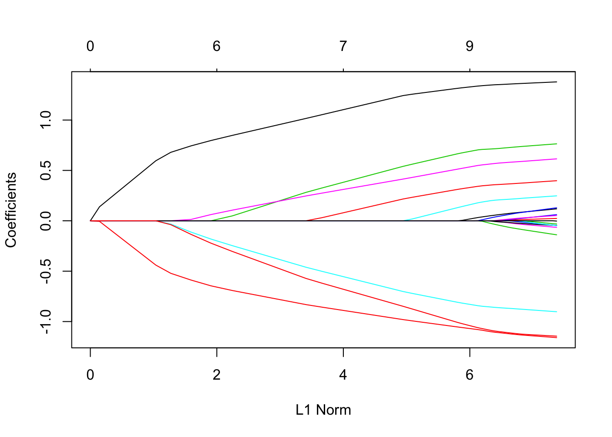

```{r setup, include=FALSE}
knitr::opts_chunk$set(echo = FALSE, warning = FALSE, message = FALSE)
```

```{r, include=FALSE}
source("../R/practice_data.R")
source("../R/functions_final.R")
```

## Group 3 Objective: Association between dependent and independent variables

The objectives were to create summaries and visualizations of how the dependent variable is associated with the different independent variables. Our goal was to develop different models to analyze these associations in the data. Our work included:

- generalized linear models
- scatterplots
- supervised learning methods, including RandomForest, Regression Trees, and Lasso.  


## Rationale: 
- If we can discover specific characteristics of the drugs that are associated with effectiveness against TB, this will help the researchers understand varying drug mechanisms in the body using a mouse model.

- The dependent variables tested included drug concentrations in the lung tissue and spleen. The independent variables included several _in vivo_ (mouse model) and _in vitro_ tests that were performed by the TB research group.

<<<<<<< HEAD
## Idea development: 

We explored various models to see if there were associations detected between independent and dependent variables. It was challenging to make strong conclusions about association in this analysis because the dataset provided at this stage was small and did not include many drugs, however, we did discover similar patterns with certain _in vitro_ or _in vivo_ tests and ELU. We also explored changes in these associations by different drug doseage, and interestingly drug dose appears to be an effect modifier on some of the relationships, so that will be interest to follow up on as more data is provided. 
=======
## Idea development:

- Getting to know the dataset 
- Exploring different visualization techniques
- Try various models to see if there were associations detected between independent and dependent variables
- Choose a model or technique and learn how to use it more in depth
- Write a function for each of our models, making them easy to use and giving useful output

## Room for errors: 

- So far, we have focused on getting working prototypes, without making sure they’re error-proof and robust to a user doing something non-standard. Identify 3 things a user could do that could make your functions “break” (i.e., either return an error message or return something other than what you hope they will):

- Very low or high number of observations in the input dataset
- One thing that we noticed was in the individual drug data, the "NA", or missing data for spleen_efficacy had a space. This type of variation in how missing data is recorded could cause problems for the functions.
- If drug names or codes change, this could create potential problems


## Room for errors (continued): 
- If new independent variables or measurements are added to the dataframe
- The dataset provided included two dose frequency combinations, 50 BID and 100 QD. If these dose and frequency combinations change it could cause problems with some of the functions. 
- The current functions intake a "tidy" form of the dataframe, `efficacy summary`, with column names including: "drug", "dosage", "dose_int", "level", "PLA", "ULU", "RIM", "OCS", "ICS", "SLU", "SLE", "ELU", "ESP", "cLogP", "huPPB", "muPPB", "MIC_Erdman", "MICserumErd", "MIC_Rv", "Caseum_binding", and "MacUptake".


## Next steps: 

- Include a section where you describe what you think are interesting next steps, i.e., what you would pursue next if you were continuing work on this project. Lay out explicitly a few ideas (2–3) that you think would be helpful. Be sure, when relevant, to describe how feedback from the project researchers helped in forming these ideas for next steps. 

-The next step is to include more data representing more drugs

-Validating the models (for RandomForest and Lasso) would help us understand the predictive power of the model to determine drug efficacy. The data can be subsetted and tested.

-A function could be written that runs all of the models and outputs the coefficients


## Functions, Get Ready!!!:


Image retrieved from: https://www.pinterest.com/pin/233624299389735946/


## Function 1: Fitting Linear Regression Model

- *Goal*: to fit a linear model regressing dependent on independent variables to assess the associations between them.
- *Assumptions*:  The observations are idependent, and identically distributed, the error has a normal distribution, and there is a linear relationship between independent and dependent variables 
- *Inputs*: include peak_trough, or the dep_var (options are ELU or ESP). 
- *Output*:  provides a plot object of the normalized model coefficients for each independent variable
- *Note*: The units of scale for each independent variable were normalized so that we could compare across coeficients. 

##Linear Regression Function Code
```{r echo=TRUE, eval=FALSE}
linear_model <- function(peak_trough, dep_var, 
                      data = efficacy_summary) {
  function_data <- data %>% 
    filter(level == peak_trough) %>% 
    gather(key = independent_var, value = indep_measure, 
           -drug, -dosage, -dose_int, -level, -ELU, -ESP, 
           na.rm = TRUE) %>% 
    select(drug, dosage, dose_int, level, dep_var, 
           indep_measure, independent_var) 
  
if(dep_var=="ELU") 
  {function_data$vect <- function_data$ELU}
if(dep_var=="ESP") 
  {function_data$vect <- function_data$ESP}

  model_function <- function(data) {
    model_results <- lm(vect ~ scale(indep_measure), 
                        data = data)      
    }
```
    
##Function Code, Continued
```{r echo=TRUE, eval=FALSE}
  estimate_results <- function_data %>% 
    group_by(independent_var, dose_int) %>% 
    nest() %>% 
    mutate(mod_results = purrr::map(data, 
                            model_function)) %>% 
    mutate(mod_coefs = purrr::map(mod_results, 
                            broom::tidy)) %>% 
    select(independent_var, dose_int, mod_results, 
                            mod_coefs) %>% 
    unnest(mod_coefs) %>% 
    filter(term == "scale(indep_measure)")
```

##Linear Model Function Code, Continued
```{r echo=TRUE, eval=FALSE}
  coef_plot <- estimate_results %>%
    mutate(independent_var = forcats::fct_reorder(
        independent_var, estimate, fun = max)) %>%
    rename(Dose_Interval = dose_int) %>% 
    ggplot(aes(x = estimate, y = independent_var, 
              color = Dose_Interval)) +
    geom_point(aes(size = 1 / std.error)) +
    scale_size_continuous(guide = FALSE) +
    theme_few() + 
    ggtitle(label = "Linear model coefficients as function 
            of independent variables, \n by drug dose and 
            model uncertainty", subtitle = "Smaller points 
            have more uncertainty than larger points") +
    geom_vline(xintercept = 0, color = "cornflower blue") 
  
  coef_plot
}
```

## Linear Model Function, Input Parameters:
- function name: `linear_model`
- default dataframe: `efficacy_summary`
- required: `dep_var` options: "`ELU`" (lung efficacy) or "`ESP`" (spleen efficacy)
- required: `peak_trough` options: "`Cmax`" or "`Trough`"


## Linear Model- Visualize independent variable coefficients - ELU

```{r, echo=TRUE, fig.width= 6, fig.height= 3, fig.align ='center'}
#Sample code for function, linear_model (Cmax and ELU)
linear_model(peak_trough = "Cmax", dep_var = "ELU")
```


## Linear Model- Visualize independent variable coefficients - ESP

```{r, echo=TRUE, fig.width= 6, fig.height= 3, fig.align ='center'}
#Sample code for function, linear_model (Cmax and ESP)
linear_model(peak_trough = "Cmax", dep_var = "ESP")

```

## Linear Model Interpretation

- Coefficients that are far right or far left are most strongly associated relationships between independent and dependent variables

- If the coefficient is negative, for example, as it is with *MacUptake* in the ELU  linear regression model, an interpretation would be for every unit of change in the MacUptake, the ELU will decrease by 0.5 Units. Therefore, MacUptake has a negative relationship with ELU. The diameter of the point represents the level of certainty of the coeficient in this model. This may change as more data is collected for each drug.


## Regression Tree Function

- *Goal:* This function will tell you the type and level of independent variable that are most important in determining the level of dependent variable of interest (ELU or ESP).
- Output is a regression tree plot based on the parameters you choose (examples below)

## Regression Tree Function code

```{r, echo=TRUE, eval=FALSE}
rpart(ELU ~  drug + dosage + level + 
      plasma + `Uninvolved lung` + `Rim (of Lesion)` + 
      `Outer Caseum` + `Inner Caseum` + 
        `Standard Lung` + `Standard Lesion` + cLogP + 
        `Human Plasma Binding` + 
        `Mouse Plasma Binding` + `MIC Erdman Strain` + 
      `MIC Erdman Strain with Serum` + 
        `MIC rv strain` + `Caseum binding` + 
        `Macrophage Uptake (Ratio)`,
      data = function_data, 
      control = rpart.control(cp = -1, 
                              minsplit = min_split, 
                             minbucket = min_bucket))
```

## Regression Tree Function input parameters

- `dep_var` options: "ELU" (lung efficacy) or "ESP" (spleen efficacy)
- `min_split`: numeric input indicating minimum # observations for a split to be attempted
- `min_bucket`: numeric input indicating minimum # observations in a terminal node
- `data = efficacy_summary` (default; must use this to run properly)

```{r, echo=TRUE, eval=FALSE}
regression_tree(dep_var = "ELU", min_split = 8, 
                min_bucket = 6)
```

## Regression Tree Function example (ELU)

```{r}
regression_tree(dep_var = "ELU", min_split = 8, min_bucket = 4)
```

## Regression Tree Function interpretation

- The number at the top of each node is indicating the mean of the outcome variable for the observations in that node (mean of 1.5 for node 1). 
- Starting from node 1, the first split is made so that it leads to the greatest possible reduction in residual sum of squares (RSS). 
- Node 3 is a terminal node because it only has 4 observations (parameter: `min_bucket` = 4). 
- Node 2 splits again because it has 16 observations (parameter: `min_split` = 8). 
- This process continues until either the `min_split` or the `min_bucket` parameters are fulfilled for each node.  

## Regression Tree Function example (ESP)

```{r}
regression_tree(dep_var = "ESP", min_split = 8, min_bucket = 4)
```

## LASSO Function 
####Least Absolute Shrinkage Selector Operator
*Background* We want to predict our outcome using the varibles we have in front of us; it is the next generation of step-wise regression anf can handle more varaibles than samples. 

- Shrinks parameters, preventing multicollinearity.
- Decreases model complexity by coefficient shrinkage (in this case to absolute zero, which is the main difference when compared to ridge regression)

##Example
```{r, out.width = "800px"}

```

## LASSO Function 
####Least Absolute Shrinkage Selector Operator
- *Goal*: to fit a model with the correct parameters
- *Assumptions*:  Still parametric (iid) normal residuals.
- *Inputs*: Dependant varaible, dose, dataframe (though a default is assuemd)
- *Output*: coefficients


## LASSO Function part 1 preparing the data
```{r echo=TRUE, eval=FALSE}
LASSO_model <- function(dep_var, dose, df = efficacy_summary) {
  data <- na.omit(df) %>% 
  select_if(is.numeric) %>%
  filter(dosage == dose)

response <- df %>% 
  select(dep_var)

predictors <- df %>%
  select(c("PLA", "ULU", "RIM", "OCS", "ICS", "SLU", "SLE", "cLogP",
           "huPPB", "muPPB", "MIC_Erdman", 'MICserumErd',
           "MIC_Rv", "Caseum_binding", "MacUptake"))

y <- as.numeric(unlist(response))
x <- as.matrix(predictors)
```

## LASSO Function part 2, glmnet
```{r echo=TRUE, eval=FALSE}
fit = glmnet(x, y)

coeff <- coef(fit,s=0.1)
coeff <- as.data.frame(as.matrix(coeff))
}
```

## Testing LASSO function:
```{r echo=TRUE, eval=FALSE}
LASSO_model(dep_var = "ELU", dose = 50)
```

```{r}
LASSO_model(dep_var = "ELU", dose = 50)
```

- These are the raw coefficents and an intercept on an penalized maximum likelihood model. It computes a penalty for small coefficents and drops them, resulting in only the coefficents with the most predictive power remaining.  


## RandomForest Function

- The user specifies which dependent variable they would like to use (either ELU or ESP). The user can also specify a dataset they would like to use, if one is not provided then a default dataset is utilized. The function var_importance takes the input and outputs a graph displaying the which variables are the best predictors of the input (either ELU or ESP). 
```{r randomForest function, echo = TRUE, eval = FALSE}


efficacy.rf <- randomForest( ELU~ ., data =dataset,
              na.action = na.roughfix,
                        ntree= 500, 
                        importance = TRUE)
  
```

## Testing Random Forest

```{r testing function}
best_variables("ELU")

```

## Interpretation

- This function utilizes the function randomForest to predict which variables are the most important predictors of the associated outcome. This model works by randomly creating small data nodes that are split using the best predictor from a subset of predictors randomly chosen at each node. In order to determine variable importance, the algorithm looks at how much the predictive error increases as all variables remain unchanged while one is permuted. The resulting output shows the % increase in the mean standard error for each variable considered individually. The higher the number the more important the variable for model building. 


## Room for errors: 
These functions may be prone to several errors if:

- Input datasets have  low or high number of observations 

- Missing data are recorded differently. We noticed in the individual drug data, the "NA", or missing data for spleen_efficacy had a space before the NA. This type of variation in how missing data is recorded could cause problems for the functions.

- If drug names or codes change, this could create potential problems


## Room for errors (continued): 
- If new independent variables or measurements are added to the dataframe

- The dataset provided included two dose frequency combinations, 50 BID and 100 QD. If these dose and frequency combinations change it could cause problems with some of the functions. 


## Next steps: 

- The next step is to include more data representing more drugs

- Validating the models (for RandomForest and Lasso) would help us understand the predictive power of the model to determine drug efficacy. The data can be subsetted and tested.

- These predictive models could be combine in a function to output all of the coefficients; then compared. 